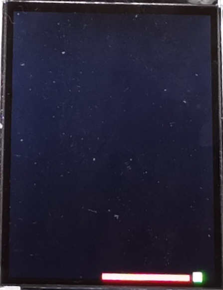

The project aim to give support to those who are getting stuck in Southampton ELEC1201-C11 lab. The environment is Eclipse, have a go with the program and you will find out the interest of programming.  
The game requires rotary encoder and PORT D of the board.
The project aims for improving learning outcome from the lab, but not coping the code dirctly. It is aleays great if you could learn from it and write your own one or at least pick up the main idea of the function and create a better one.  
